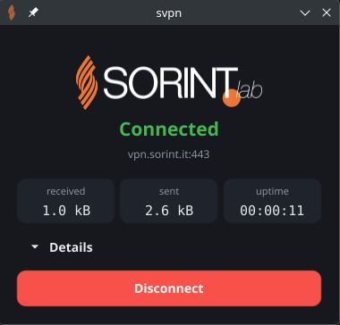

<p align="center">
  
</p>

# svpn

Connect to the Sorint.LAB VPN with ease.

<p align="center">
  <a href="https://github.com/paccolamano/svpn/actions/workflows/ci.yml"></a>
  <a href="https://github.com/paccolamano/svpn/releases/latest"></a>
  <a href="go.mod"></a>
  <a href="LICENSE"></a>
  
</p>

A FortiGate SSL VPN client in Go, with no external components: no
`openfortivpn`, no `pppd`, no NetworkManager plugin. A privileged daemon owns
the connection, and two unprivileged clients drive it — a command line and a
window. Either will do; they are the same client underneath.

```sh
svpn up       # authenticate in the browser, then connect
svpn status
svpn down
```

```sh
svpn-gui      # or the same thing from your applications menu
```

## Why a daemon

Connecting a VPN means creating a network interface, rewriting the routing
table and redirecting DNS. All three are global to the machine and gated behind
`CAP_NET_ADMIN`, and a desktop client has no terminal to type a sudo password
into. So the privilege is taken once, at install time, by a service — and
everything else runs as an ordinary user and asks that service to act.

```
svpn      ─┐
           ├──unix socket──> svpnd (daemon) ──> svpn0, routes, DNS
svpn-gui  ─┘   your uid          root
```

The client performs the SAML login, because it owns your browser session, and
hands the resulting cookie to the daemon. The daemon never needs a browser, a
display, or your identity provider: the cookie is all of your identity it ever
sees.

This is the split Mullvad, Tailscale and Docker all use, and it is the only one
that lets a GUI connect a VPN without asking for a password every time.

## Install

```sh
curl -fsSL https://raw.githubusercontent.com/paccolamano/svpn/main/install.sh | sh
newgrp svpn      # or log out and back in
svpn up
```

The script resolves the latest release, checks the archive against its
published SHA-256, unpacks it and runs `svpnd install`. It decides nothing
itself — everything about the installation lives in the binary.

If you would rather not pipe a script into a shell, do the same by hand:
download the archive and `SHA256SUMS` from the
[latest release](https://github.com/paccolamano/svpn/releases/latest), then

```sh
sha256sum -c --ignore-missing SHA256SUMS
tar -xzf svpn_*_linux_amd64.tar.gz
sudo ./svpnd install
```

Or from source:

```sh
make build
sudo ./bin/svpnd install
```

All three end in the same place. `svpnd install` copies the binaries to
`/usr/local/bin`, creates the `svpn` group, adds you to it, writes the systemd
unit and `/etc/svpn/svpnd.env`, and starts the service. `--dry-run` prints what
it would do; `--prefix`, `--unit-dir` and `--conf-dir` move any of it.

The desktop client comes with it when the archive has one, along with a
launcher entry so it appears in your applications menu. The **amd64** archive
has one; the **arm64** archive does not, because Fyne needs an OpenGL toolchain
built for the target and cross-compiling that is a different problem from
cross-compiling Go. On a machine with no display, `--no-gui` skips it:

```sh
curl -fsSL https://raw.githubusercontent.com/paccolamano/svpn/main/install.sh | sh -s -- --no-gui
```

`svpnd update` keeps whichever choice you made — it looks for an installed
`svpn-gui` before handing over, so a server does not acquire a window the first
time it updates.

**The `newgrp` is not optional, and opening a new terminal is not a substitute.**
`usermod -aG` does not reach sessions that already exist, because a process's
groups are fixed by `setgroups` at login and nothing can add one afterwards —
which is why `newgrp` starts a new shell rather than changing the one you ran
it in. A new terminal window is forked from your desktop session, which
predates the group, so it inherits the same list. Only `newgrp` (that shell) or
a fresh login (everything) works. Without one, the first `svpn up` cannot open
the socket — the client says exactly that when it happens.

The daemon needs no arguments: every default — gateway, socket, interface,
group — is the Sorint one, and they live in `internal/sorint`. The one thing
the installation adds is `--allow-uid` for your account, in
`/etc/svpn/svpnd.env`. Edit that file to change the daemon's flags; the next
install merges into it rather than overwriting it, so a second user is added
to the allowlist instead of replacing the first.

### Updating

```sh
sudo svpnd update           # download the latest release and install it
sudo svpnd update --check   # or just ask
svpn version                # what is installed, and what the daemon is running
```

There is no package manager in this picture, so this is the update channel.
`update` verifies the archive against its published checksum and then runs the
installer *from the version it just downloaded*, so an upgrade that needs a
different installation procedure brings that procedure with it.

The checksum proves the download arrived intact, not where it came from — the
archive and `SHA256SUMS` are published together. For provenance, every release
carries a build attestation:

```sh
gh attestation verify svpn_1.0.0_linux_amd64.tar.gz --repo paccolamano/svpn
```

A running daemon carrying a live tunnel is left alone rather than restarted:
the new binary takes effect after `svpn down`, or immediately with `--restart`.

### Uninstalling

```sh
sudo svpnd uninstall           # stop, disable, remove the unit and binaries
sudo svpnd uninstall --purge   # and the group and /etc/svpn/svpnd.env
```

Stopping the service sends a TERM, which is what lets the daemon close the
tunnel and put the routing table back before it exits.

## Usage

```sh
svpn up          # opens a browser, authenticates, connects
svpn status
svpn down
```

Never run these under `sudo`. That would make the client uid 0, which the
daemon's allowlist of ordinary users refuses — correctly. The client is meant
to be unprivileged; that is the whole point of the split.

`svpn login` does the browser half on its own and prints the cookie, for
scripting or for holding one across several attempts. `svpn up --cookie` then
reuses it and skips the browser.

Every command takes `--json` for a machine-readable answer, `--debug` for the
protocol exchange, and `--detailed-errors` for stack traces.

The answer goes to stdout and the diagnostics to stderr, so `svpn status --json
| jq` works while warnings still reach you. Diagnostics read like any other
command — `svpn: error: …`, plain text, no colour anywhere. The daemon writes
the same lines with a syslog priority prefix when systemd is reading them, so
`journalctl -p err -u svpnd` finds errors and nothing repeats the timestamp
journald already recorded.

## Access control

A daemon running as root creates a root-owned socket that no ordinary user can
open, so `--socket-group` hands it to a group instead; the systemd unit does
the same through `Group=svpn`.

The socket is created mode 0660, so filesystem permissions are the first gate.
Past that, the daemon reads the caller's identity from the kernel with
`SO_PEERCRED` — unforgeable, unlike anything a client could claim — and
`--allow-uid` restricts commands to specific users. Without it, anyone who can
open the socket can drive the VPN; the daemon warns at startup when that is
the case.

The group is why a fresh installation needs one login before it works, and that
cost is deliberate. Making the socket's *owner* the installing user would
remove it, because owner permissions are checked against the uid every session
already has — but chowning to another uid needs `CAP_CHOWN`, and the unit drops
every capability except `CAP_NET_ADMIN` and `CAP_NET_RAW`. Widening the
capability set of a root daemon to save one logout is the worse trade.

This is deliberately stricter than the `docker` group model, where socket
access is equivalent to root.

**`--debug` on the daemon traces the protocol exchange, and that includes the
session cookie.** The cookie is a live credential: anyone holding it can open
the VPN as you until it expires. The daemon warns when debug logging is on.

## Debugging a connection

The protocol probes speak to the gateway and report what it says, without
creating an interface, touching routes, or going near the daemon. They need no
privileges and change nothing, which makes them the right tool when a
connection fails and the question is where.

```sh
svpn debug connect                 # login, allocation, config, tunnel, PPP
svpn debug tunnel --cookie '…'     # the same, starting from an existing cookie
svpn debug connect --dump-config   # print the gateway's raw XML
svpn debug connect --passive       # do not answer, just watch what arrives
```

Reaching `Link established` proves the gateway accepted the cookie and the
protocol works end to end. Everything after that is the operating system's
side of the problem.

## What it does

```
1.  browser  ->  https://<host>:<port>/remote/saml/start?redirect=1[&realm=…]
2.  listener on 127.0.0.1:8020  <-  GET /?id=<session-id>
3.  GET /remote/saml/auth_id?id=<id>   ->  Set-Cookie: SVPNCOOKIE=…

4.  GET /remote/index            \  the gateway allocates a VPN for the session
5.  GET /remote/fortisslvpn      /
6.  GET /remote/fortisslvpn_xml     ->  assigned address, DNS, split routes

7.  GET /remote/sslvpn-tunnel       ->  framed PPP packets
        Host: sslvpn
        Cookie: SVPNCOOKIE=…
8.  ->  LCP Configure-Request           the client speaks first
9.  LCP + IPCP negotiation           ->  assigned address, gateway, DNS
10. frame layout, big-endian:
        [total len 2B][magic 0x5050][payload len 2B][PPP packet]

11. tun device, addresses, routes, DNS                       (svpnd only)
```

Steps 4 and 5 are not optional. A cookie alone is not enough: until a VPN has
been allocated for the session, the gateway closes `/remote/sslvpn-tunnel`
without sending a response, which surfaces as an immediate EOF. They commonly
answer **403** to a non-browser client, and that is not a failure — the
allocation happens as a side effect of the request being processed.

Step 8 is not optional either. PPP is symmetric and the gateway stays silent
until the client has spoken — `openfortivpn` gets this for free because `pppd`
starts talking as soon as it is spawned. Without an opening packet the tunnel
is established but idle, and reads time out. `--passive` skips it, which
reproduces exactly that.

Step 6 decides which traffic goes where. FortiOS publishes its split-tunnel
list under either `<split-tunnel-include>` or `<split-tunnel-info><addr>`
depending on the version; reading only one of them silently yields no routes
at all, which is indistinguishable from a gateway that wants a full tunnel.
Both are read. The list repeats addresses and may collide with networks the
machine already has — a `docker0` bridge, the local LAN — so entries are
deduplicated, and a collision leaves the existing route alone and is reported
rather than aborting the connection.

The protocol is not publicly specified. Every step above follows the behaviour
of [openfortivpn](https://github.com/adrienverge/openfortivpn) (GPL-3.0), the
de-facto reference implementation. No code was taken from it.

## Platform support

| | protocol | daemon | desktop client |
|---|---|---|---|
| Linux amd64 | yes | yes | yes |
| Linux arm64 | yes | yes | not built |
| macOS | yes | not implemented | not built |
| Windows | yes | not implemented | not built |

In short: **use it on Linux.** The protocol half is pure Go and builds
everywhere, so `svpn debug connect` should work on any of these — but the
daemon returns an explicit "not implemented" on macOS and Windows rather than
pretending, and the desktop client is built for linux/amd64 only, because Fyne
needs a C toolchain for the target. The arm64 archive therefore carries the
daemon and the CLI, and `svpnd install` says so rather than quietly doing less.

## Development

```sh
make check        # everything below, in one command
make test         # with -race
make lint         # golangci-lint: formatting, vet, and the rest
make crosscheck   # every target builds, minus the two cgo packages
make check-config # the workflows, the release config and install.sh
make snapshot     # build the release archives without tagging anything
make gui-deps     # the headers Fyne links against (Debian and Ubuntu)
```

`golangci-lint` is a tool dependency in `go.mod`, so there is nothing to
install: `go tool` builds the pinned version from the module cache, and CI runs
that same one.
